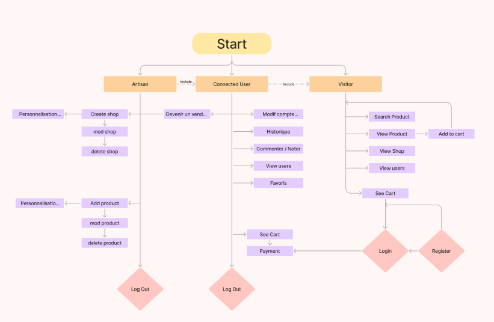

# Artisan_Store

## Besoin du client :

1. Le client souhaite la conception d'un site e-commerce qui met en valeur ses produits artisanaux avec les objectifs suivants :

2. Création d'un site esthétique mettant en avant les produits artisanaux.
   Facilitation de la navigation entre différentes catégories de produits telles que bijoux, art, décoration, etc.

3. Intégration de fonctionnalités de recherche avancée permettant la recherche par matériau, artiste ou style.

4. Mise en place d'un panier d'achat intuitif avec des options de personnalisation des produits (ex : choix de couleur, taille).

5. Assurer une expérience utilisateur fluide et esthétique avec une mise en page artistique.

6. Implémentation d'un système de gestion des utilisateurs pour les comptes clients incluant les informations nécessaires à la livraison.

7. Création d'un espace dédié aux artistes/artisans pour présenter leurs profils et créations.
   Chaque produit sera accompagné d'une histoire ou d'une anecdote sur l'artisanat derrière sa création.

8. Mise en place de pages dédiées aux artisans incluant des informations sur l'artisan, son histoire, sa manière de fabriquer les objets, ses spécialités, sa localisation approximative, etc.
   *Posibilité d'ajouter des produits artisanaux personnalisés sur demande.*

9. Intégartion'outils de partage sur les réseaux sociaux pour promouvoir les créations.
   Les artistes et artisans auront la possibilité de gérer leurs propres comptes et de mettre à jour leurs créations.
   Utilisation de plusieurs thèmes visuels pour une mise en page différente, que l’artiste ou artisan pourra choisir afin de mettre en avant ses produits.

# Remarques

### Prérequis a respecter :

- Limiter le recours aux carrousels
- Favoriser un design simple, épuré, adapté au web
- Éviter les animations JavaScript / CSS
- Adapter les textes au web
- Éviter les redirections

### Uml elaboré pour le projet :

### Documentation faire les migrations :

1. Construire les tables à l’aide des migrations de Laravel : Utilisez les migrations de Laravel pour créer les tables dans votre base de données. Chaque migration représente une table avec ses colonnes et ses contraintes.

Cette classe de migration doit être créée dans le répertoire database/migrations de votre projet Laravel. Lorsque vous exécutez la commande php artisan make:migration, Laravel génère automatiquement un fichier de migration dans ce répertoire.

Voici les étapes pour créer cette classe de migration :

- Ouvrez votre terminal ou votre invite de commande.

- Assurez-vous d'être dans le répertoire racine de votre projet Laravel.

- Exécutez la commande suivante pour créer une nouvelle migration :

** php artisan make:migration create_users_table.**

2. Créer les relations entre les tables dans les models : Définissez les relations entre les tables dans vos modèles en utilisant les fonctionnalités d'Eloquent ORM de Laravel. Par exemple, définissez les relations hasOne, hasMany, belongsTo, etc.
Tu peux faire cela dans les models.

3. Créer des données de test à l’aide des factories et des seeders : Utilisez les factories pour définir comment générer des données fictives pour chaque modèle. Ensuite, créez des seeders qui utilisent ces factories pour insérer les données fictives dans votre base de données.

